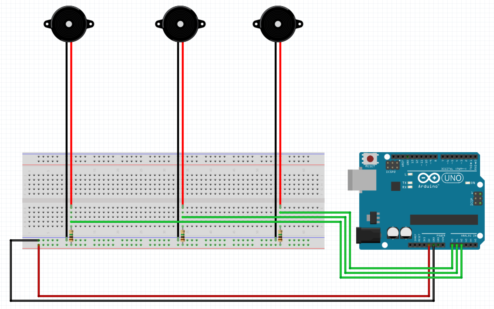

# wekinator_processing_arduino_howto

A small tutorial on how to get data from an [arduino](https://www.arduino.cc/) send it to [wekinator](http://www.wekinator.org/) for ML and send it back to [processing](https://processing.org/)

Here is the end result you should achieve when following this tutorial :

The goal is to use 3 piezo disks to detect touch / gestures inputs on a piece of wood.

For this we use :
- [arduino](https://www.arduino.cc/) : to get the sensor data and communicate the values via Serial (USB)
- [processing](https://processing.org/) : to get the values from serial and send them to wekinator via OSC (some kind of UDP communication protocole), and get data back from wekinator.
- [wekinator](http://www.wekinator.org/) : to analyse the analog values from the piezo and detect some input gestures through ML pattern matching algorithms with a training phase.

## Arduino circuit

You will need :
- arduino uno
- 3 piezo disks
- 3 resistors of 1M ohm
- breadboard and jumpers.
- usb cable

Here is the schematics of the circuit you should reproduce : 

## Processing code to get values from arduino

## Processing code to send values to wekinator

## Wekinator setup - interface and manipulation

### setup

### training

### running

## Processing code to get the results from wekinator.
