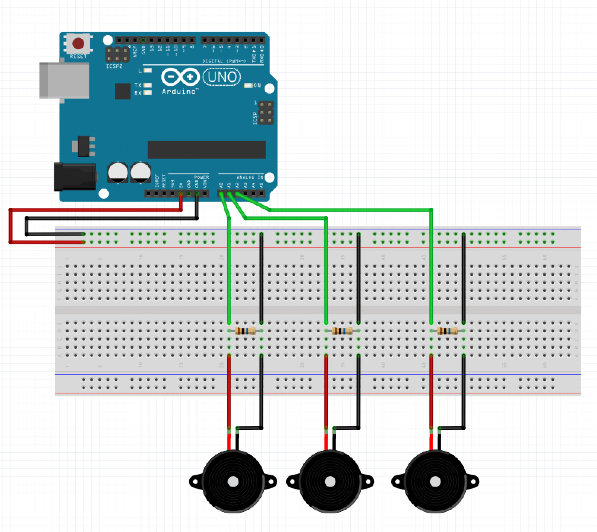

# wekinator_processing_arduino_howto

A small tutorial on how to get data from an [arduino](https://www.arduino.cc/) send it to [wekinator](http://www.wekinator.org/) for ML and send it back to [processing](https://processing.org/)

Here is the end result you should achieve when following this tutorial :

**TODO -> add gif**


The goal is to use 3 piezo disks to detect touch / gestures inputs on a piece of wood.

For this we use :
- [arduino](https://www.arduino.cc/) : to get the sensor data and communicate the values via Serial (USB)
- [processing](https://processing.org/) : to get the values from serial and send them to wekinator via OSC (some kind of UDP communication protocole), and get data back from wekinator.
- [wekinator](http://www.wekinator.org/) : to analyse the analog values from the piezo and detect some input gestures through ML pattern matching algorithms with a training phase.


## Arduino circuit & code

You will need :
- arduino uno
- 3 piezo disks
- 3 resistors of 10M ohm
- breadboard and jumpers.
- usb cable

Here is the schematics of the circuit you should reproduce : 



You can use double sided tap, to stick the piezzo to a piece of wood, like this : 


The code is pretty straight forward. You want to read the data from the analog inputs and print those into the serial console to first visualize them use the plotter and thus be sure that the connections are ok and the data is usable.

```c
void setup() {
  Serial.begin(115200);
}

void loop() {
   // to trace the output
  Serial.print(analogRead(0));
  Serial.print(",");
  Serial.print(analogRead(1));
  Serial.print(",");
  Serial.print(analogRead(2));
  Serial.println();

}
```

Once everything is ok, you can use this code for sending data to processing. The idea is to create a json string rather than using the comma separated values. It doesn't really matter how you do it - but I do prefer using json syntax for this kind of things.

```c
void setup() {
    Serial.begin(115200);
}

void loop() {
    // to communicate to processing
    String json;
    json = "{\"p1\":"; // on ajoute la première clé "photor1"
    json = json + analogRead(0);
    json = json +",\"p2\":";
    json = json +  analogRead(1);
    json = json +",\"p3\":"; 
    json = json +  analogRead(2);
    json = json + "}";
    Serial.println(json);

    // to trace the output
    /*
    Serial.print(analogRead(0));
    Serial.print(",");
    Serial.print(analogRead(1));
    Serial.print(",");
    Serial.print(analogRead(2));
    Serial.println();*/
}
```


## Processing code to get values from arduino


## Processing code to send values to wekinator


## Wekinator setup - interface and manipulation

http://www.wekinator.org/detailed-instructions/#Dynamic_time_warping_in_Wekinator

### setup

### training

### running

## Processing code to get the results from wekinator
