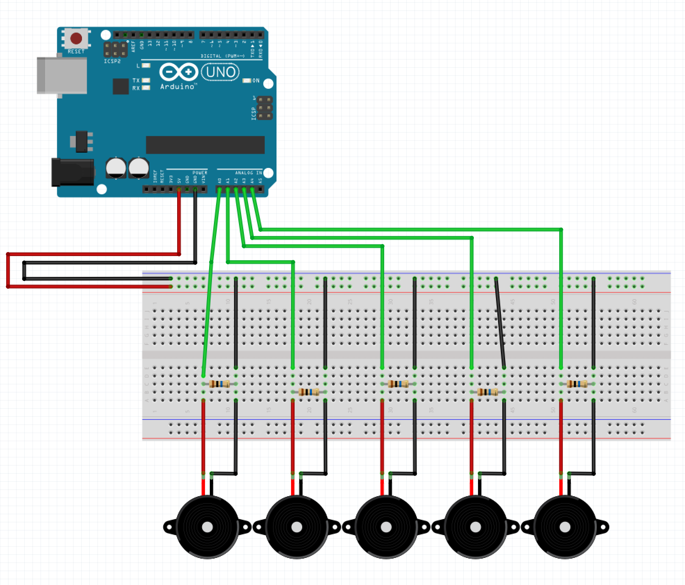

# wekinator_processing_arduino_howto

A small tutorial on how to get data from an [arduino](https://www.arduino.cc/) send it to [wekinator](http://www.wekinator.org/) for ML and send it back to [processing](https://processing.org/)

Here is the end result you should achieve when following this tutorial :

**TODO -> add gif**


The goal is to use 3 piezo disks to detect touch / gestures inputs on a piece of wood.

For this we use :
- [arduino](https://www.arduino.cc/) : to get the sensor data and communicate the values via Serial (USB)
- [processing](https://processing.org/) : to get the values from serial and send them to wekinator via OSC (some kind of UDP communication protocole), and get data back from wekinator.
- [wekinator](http://www.wekinator.org/) : to analyse the analog values from the piezo and detect some input gestures through ML pattern matching algorithms with a training phase.


## Arduino circuit & code

You will need :
- arduino uno
- 3 piezo disks
- 3 resistors of 10M ohm
- breadboard and jumpers.
- usb cable

Here is the schematics of the circuit you should reproduce : 



You can use double sided tap, to stick the piezzo to a piece of wood, like this : 


The code is pretty straight forward. You want to read the data from the analog inputs and print those into the serial console to first visualize them use the plotter and thus be sure that the connections are ok and the data is usable.

```c
void setup() {
  Serial.begin(9600);
}

void loop() {
   // to trace the output
    Serial.print(analogRead(0));
    Serial.print(",");
    Serial.print(analogRead(1));
    Serial.print(",");
    Serial.print(analogRead(2));
    Serial.print(",");
    Serial.print(analogRead(3));
    Serial.print(",");
    Serial.print(analogRead(4));
    Serial.println();

}
```

Once everything is ok, you can use this code for sending data to processing. The idea is to create a json string rather than using the comma separated values. It doesn't really matter how you do it - but I do prefer using json syntax for this kind of things.

```c
void setup() {
    Serial.begin(9600);
}

void loop() {
    // to communicate to processing

  String json;
  json = "{\"p1\":";
  json = json + analogRead(0);
  json = json + ",\"p2\":";
  json = json +  analogRead(1);
  json = json + ",\"p3\":";
  json = json +  analogRead(2);
  json = json + ",\"p4\":";
  json = json +  analogRead(3);
  json = json + ",\"p5\":";
  json = json +  analogRead(4);
  json = json + "}";
  Serial.println(json);


  // to trace the output
  /*
    Serial.print(analogRead(0));
    Serial.print(",");
    Serial.print(analogRead(1));
    Serial.print(",");
    Serial.print(analogRead(2));
    Serial.print(",");
    Serial.print(analogRead(3));
    Serial.print(",");
    Serial.print(analogRead(4));
    Serial.println();
    */
}
```


## Processing code to get values from arduino

To get the values from arduino inside processing we use the serial library that is already included in the processing package. The idea is to read the data printed by the arduino code at line 21. This data is a string formatted as a json string.

The serial library comes with a specific function called *serialEvent*, the code is this function will be called each time a serial event is comming in, that means each time arduino sends data i.e. each time we use our *Serial.println()* at line 81.

So ...

### Init and connect

First things first, in processing let's include the lib and declare some variables to represent ou serial connection and to store the incomming data from arduino - this is done before the setup() :

```java
import processing.serial.*;
Serial myPort; 
int p1, p2, p3, p4, p5;
```

Now **inside the setup**, we need to detect the serial hardware connected to our computer; the following will just list everything you have connected and display it in the processing console :
```java
 printArray(Serial.list());
 ```

I should look like this if you are on mac :
```
[0] "/dev/cu.Bluetooth-Incoming-Port"
[1] "/dev/cu.MALS"
[2] "/dev/cu.SOC"
[3] "/dev/cu.UEBOOM2-LWACP"
[4] "/dev/cu.usbmodem144101"
[5] "/dev/tty.Bluetooth-Incoming-Port"
[6] "/dev/tty.MALS"
[7] "/dev/tty.SOC"
[8] "/dev/tty.UEBOOM2-LWACP"
[9] "/dev/tty.usbmodem144101"
```

Now you need select the right hardware for me the arduino is the number four. And open a serial connection with this device :
```java
String portName = Serial.list()[4]; // change accordingly
myPort = new Serial(this, portName, 9600);
myPort.bufferUntil('\n');
```

Notice the *9600* value, this is the speed of communication. This value should match the one you entered in your arduino code (in the setup - when you write *Serial.begin()*).

### Get the values

As mentionned earlier we use the *serialEvent* function, we need to declare it outside of the setup or the draw :

```java
void serialEvent (Serial myPort) {

}
```

Now we need to fill it with code, most of this code is tests and stuff to ensure that the data comming in is the thing we want. You probably won't have to change it or rewrite things in this part all you actually need to worry is the code inside the *else* statement

```java
try { // try but don't crash if it doesn't work ;)
    while (myPort.available() > 0) { // as the port is available
      String inBuffer = myPort.readStringUntil('\n'); // read the incoming buffer until you reach the end of a line 
      // the end of the line is the end of our string since we are using println in arduino.
      if (inBuffer != null) { // check if there is actually something.
        if (inBuffer.substring(0, 1).equals("{")) { // if it begins with "{" it should be our json-string
          JSONObject json = parseJSONObject(inBuffer); // transform our string into a json object so we can easily get the values
          if (json == null) {
            println("JSONObject could not be parsed");
          } else {
            // this is finally the end of the tests an were we actually do things
            // get the values into global variables according to their keys
            p1    = json.getInt("p1"); 
            p2    = json.getInt("p2");
            p3    = json.getInt("p3");
            p4    = json.getInt("p4");
            p5    = json.getInt("p5");
            
          }
        } else {
        }
      }
    }
  } 
  catch (Exception e) {
  }

```
And that's all ! the values from our sensors are now stored in our global variables.

## Processing code to send values to wekinator


## Wekinator setup - interface and manipulation

http://www.wekinator.org/detailed-instructions/#Dynamic_time_warping_in_Wekinator

### setup

### training

### running

## Processing code to get the results from wekinator
